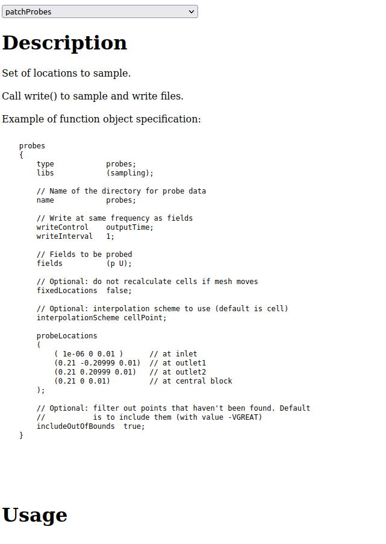

======
OFData
======

provides meta data for the openfoam library

* Free software: MIT license
* Documentation: https://ofdata.readthedocs.io.

How to use
----------

.. code-block:: bash

    python -m venv env # optional
    pip install -e .
    cd tests
    ofdata $WM_PROJECT_DIR # parse headers
    python test-flask

open in browser http://127.0.0.1:5001/func/forces/

Output
------

